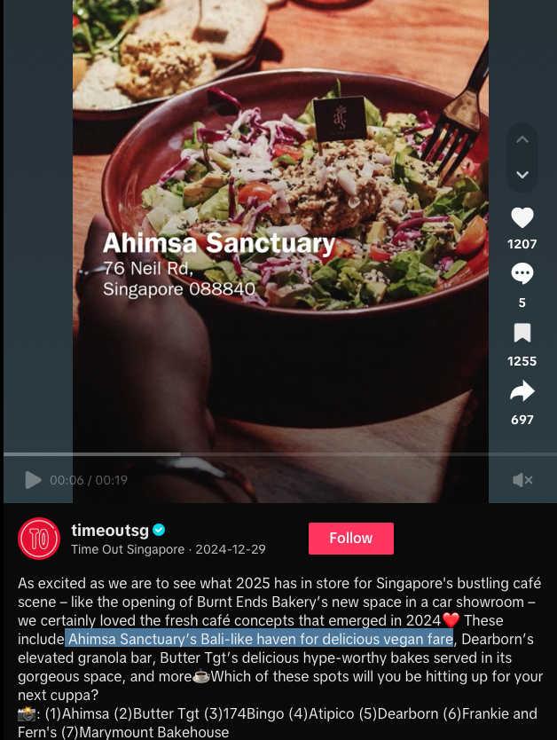
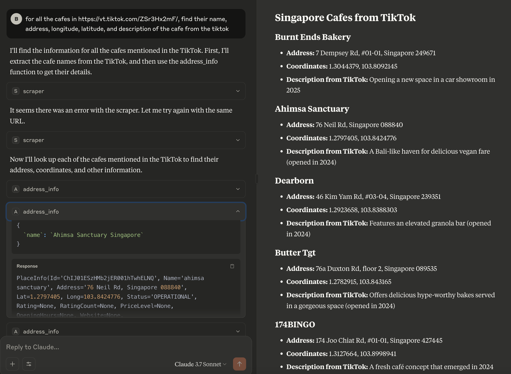
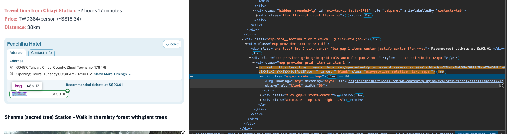
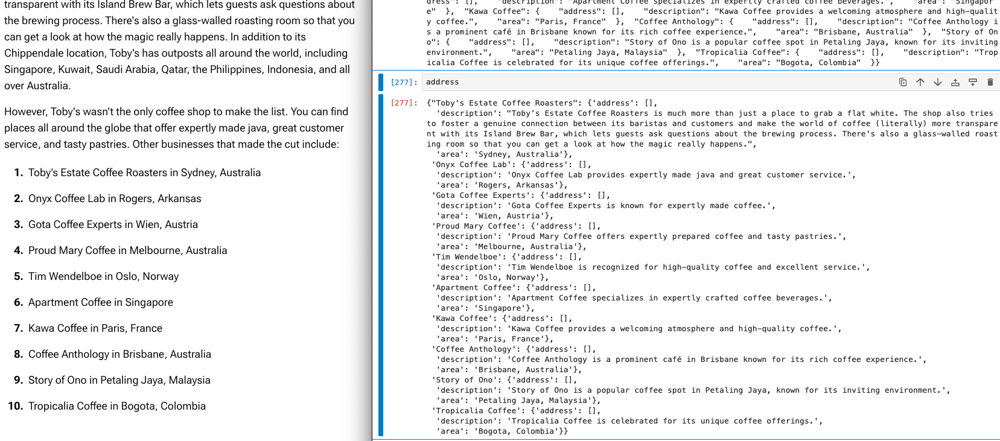
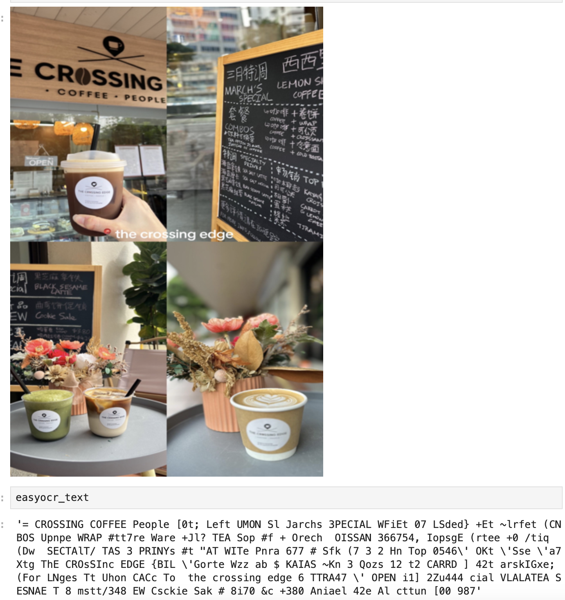
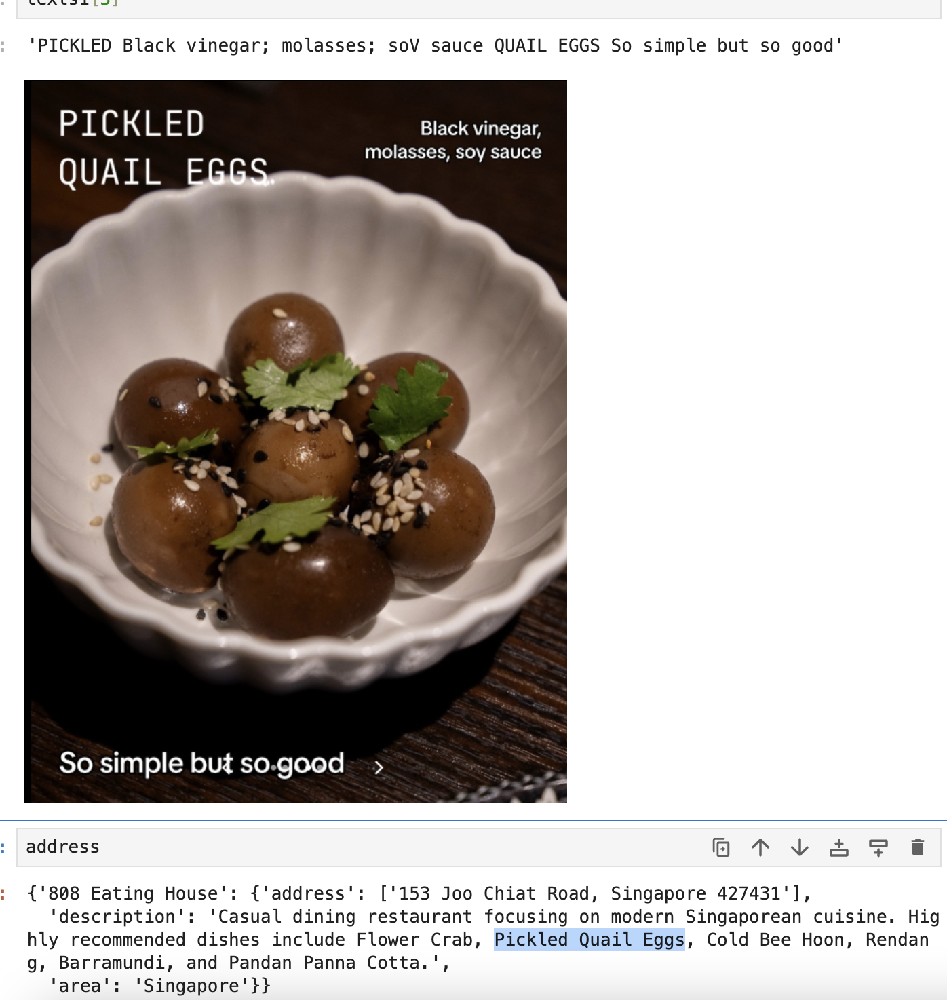

# Mapping out website links with Aumi

AI-powered map assistant that automatically extracts and visualises the locations mentioned in social media posts/websites (no more manual google map searches for the restaurants you find on tiktok). Built with Flask, React, GPT-4 API integration, Telebot API, and Google Maps API.

1. Share the link directly to telegram chat bot Aumi and access the web app

2. Or choose to input the website/tiktok/rednote link directly on the web app

3. Map renders the locations found on the page

4. Info such as description of the location from the source url, opening hours, direction info from current location etc are rendered by clicking on the location.

  
  
  

    <em>Web app visualisation on the left, source information (tiktok video+caption) on the right</em>
  

## How it works
1. Url link received (through telegram or UI input) is scraped for its html (blogposts), audio captions (videoes), or image captures (photos)
2. Name, address, and description are extracted from the scraped data using LLM processing with the appropriate prompts
3. Location information, and travelling instructions fom user's current location are queried from google maps api and rendered on a map component
4. Redis caching, flask rate limiting + frontend throttling to reduce system load

## Why is it useful
1. Bot interface = no need to download apps (ideally the user has telegram)
2. "Why not just search 'cafes near me' on google maps/ why not just ask chatgpt for recommendations": Many still rely on social media apps for direct recommendations and reviews

## Ultimate vision: LLM orchestrated agentic workflow without predetermined structure
Aumi's processes can be abstracted into a workflow comprising the following steps: 
1. Domain-aware content retrieval <code>scraper(url) -> content</code>
2. Address extractor  <code>extractor(text) -> []addresses</code>
3. Location info retriever <code>address_info(address name) -> location object</code>
4. map visualisation <code>renderer(coordinates) -> interactive component</code>
Aumi initially ewxecuted this workflow through predetermined function calls. In an LLM-orchestrated architecture, these functions are MCP servers that the model can dynamically call. Rather than following predetermined workflows, the LLM acts as the orchestrator, selecting and sequencing appropriate MCP servers to fulfill requests. 

In the following experiment, function 1 and 3 were made into independent MCP tools; when instructed to extract location details from cafes in the url, Claude was able to correctly execute this 3-step workflow with minimal prompting:

With the addition of more sophisticated MCP servers, its possible to extend the workflow to query for information like reservation availability (OpenTable MCP), ongoing promotions (website parsing MCP) etc. To achieve seamless app to app communication workflow, users can interact through any client interface (telegram webapp/web browsers/google map search bar) to trigger a call to the LLM orchestrator, instead of engaging directly with the model's chat interface.

## Challenges in accurate address extraction:
1. **Identifying core elements to process:** Exclude irrelevant content and unrelated locations from the input sent to llm models
    1. **Removing boilerplate:**  Scraped html might include irrelevant locations from ads, 'suggested relevant posts' previews, and the comment section. Extract key components using libraries like trafilatura or readability-lxml (preserves html), and fallback on soup.get_text() if extracted length is too short.
    2. **Reducing token vs Losing dom tree information**: Flattened the html hierarchy by removing all tags other than bold and list as these might be a signal for location names
    3. **Adaptive scraping**: Applied different scraping strategies for different domains. For photos, images are scraped; for tiktok videos, captions and descriptions are scraped; for everything else, only text elements are scraped. 
        - Follow up problem: If the input is an url from an unrecognised domain, information in images/videos will be missed
2. **Prompt engineering:** Prioritise precision at all cost - better to exclude some locations than to suggest something irrelevant
    1. **Few-shot**: Make use of common patterns in social media posts for location recommendations, like '📍 xxx' or '1. xxx' to better identify location names in text
    2. **Location inference**: Google APIs might pick up the wrong address for a place with multiple branches/ similar names, so it will help if the model can infer the country/area that the post is about. 
        - Follow up problem: How do we verify if the inference is correct? 
    3. **Multimodal text input**: When merging information from multiple media sources (audio transcript, textual captions, parsed images), priority is assigned to each so results are more reliable in the event that they 'contradict' (e.g. video caption contains one address of a marketplace + audio transcript about 7 stalls in that marketplace = confused model returning 8 locations)
3. **Media processing accuracy:**
    1. **Image processing with OCR** The following problems remain ~relatively~ unsolved:
        1. Hard to find a generic ocr setting/ preprocessing algorithm that can handle varying image quality/text overlay style/ background noisiness well. (Image sharpening sounds like a good idea for lower res images until the model sees a bowl of spaghetti in the background and returns uwu). 
        2. Texts from the menu/ packaging in the background become noise in ocr output
    2. **Lack of real video scraping function**: For now I'm only parsing the audio captions and descriptions for videos. Actual video processing will require keyframe extraction + additional processing, which might be computationally expensive and slow.
4. **Address validation:** Theres no effective way to verify the extracted addresses. Some ideas:
   1. **Cross-validation across models**: Engage different models, and only accept location names that appear in both (overkill)
   2. **Self-consistency check**: In a seperate prompt, ask for information like number of addresses, country/state, and check this against the previous generated list of output
   3. **Cross reference** - Reject location if it differs too much from the top result returned from google
    
## Other considerations:
1. **Cost efficiency** - MapBox instead of GMaps
2. **Performance + security** Telegram chat and input validation, *rate limiting*, queuing requests, parallelize ocr tasks

## Future features:
1. List management - allow users to merge location lists generated from different urls under the same map view
2. Expand with more information - restaurant deals/reservation availability etc
3. Allow for collaborative edits for group planning
4. Support for other languages + maps (amap for cn, kakao map for kr)

## Todo
- ~~Add traffic navigation - get users current location~~
- ~~Adopt proper compoenents from chakra~~
- ~~Allow edits to user location~~
- ~~Add video and image parsing~~ Note! will not work on videos with no captions/descriptions, and the accuracy for photo ocr is limited atm
- ~~Integrate with telegram as web app bot~~
- ~~Add non-local cache for scraper calls~~
- ~~Add rate limiter and quota~~
- ~~Add location description from source url~~
- ~~Have different prompts for different scraping strategy~~
- Omg the phone ui looks so bad - migrate to shardcn(?)
- Deploy
- Register user info + save chat data
- Add tests
- Set up dark and light mode

## Appendix

#### Overt vs subtle ads on websites
Soft ads cant be identified by readability (since it is sponsored content maybe we should leave it be?)

#### Model hallucination
If the input text has unbalanced content for the locations (a whole paragraph on one but only listing the names of the others), the model will hallucinate similar description for all. Prompt was changed to allow for empty results to avoid this

#### Noisy backgrounds
Better preprocessing needed for messy backgrounds

#### Scrambled texts
Pretty impressive that the model can still understand 'pickled quail eggs' as one sentence despite the text being scrambled (ocr setting changed to paragraph=True to avoid this)

