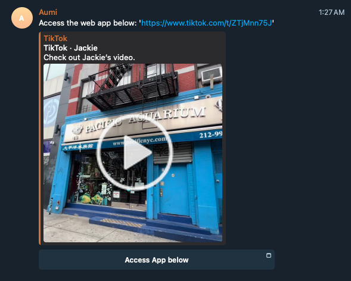
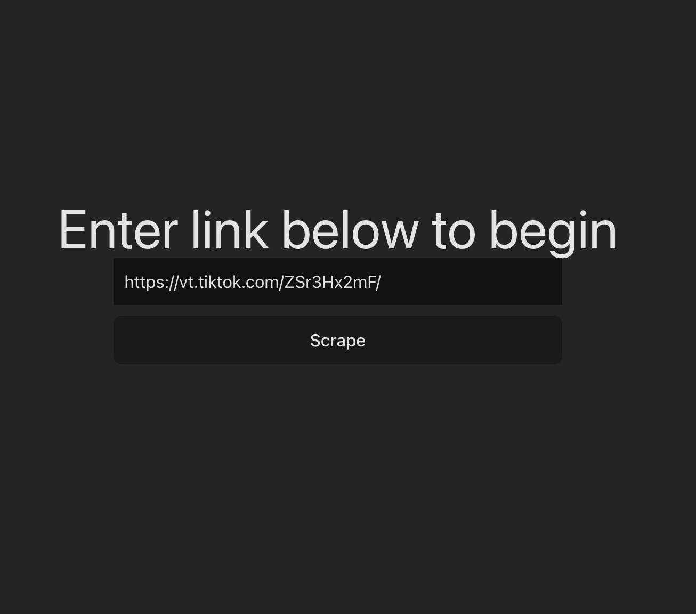
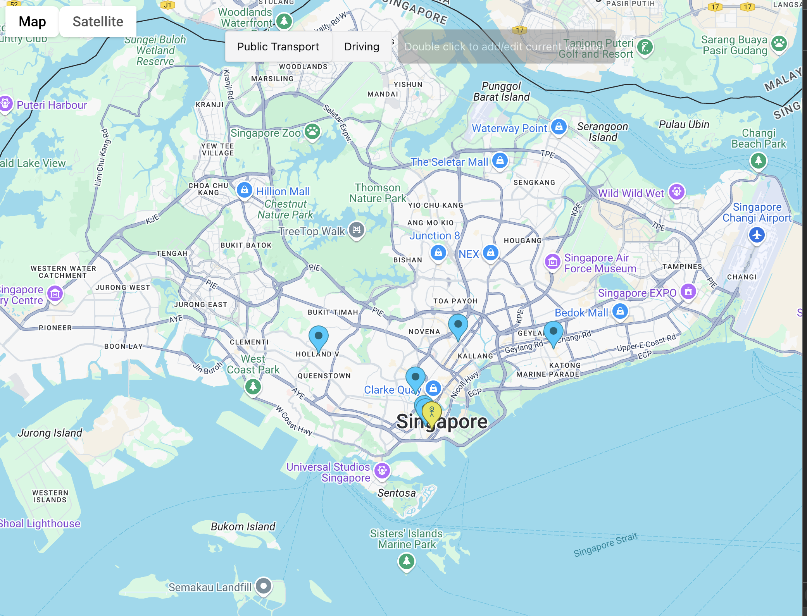
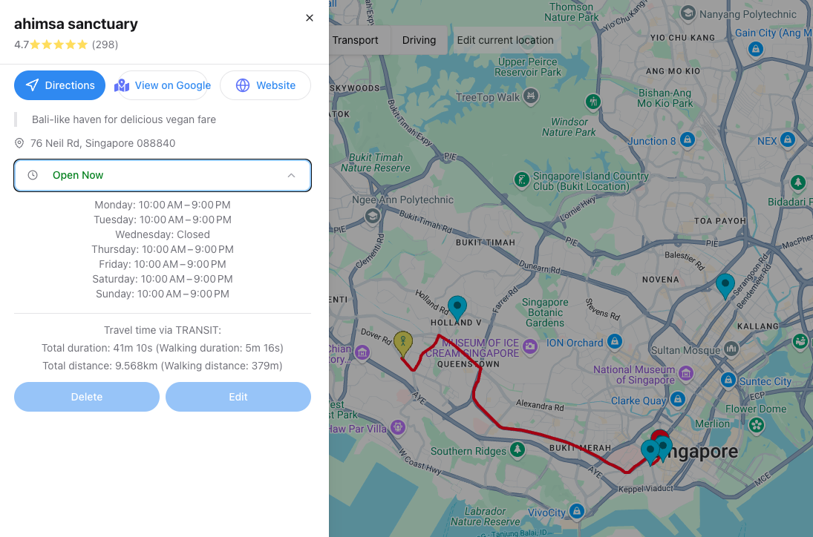

# Mapping out website links with Aumi

AI-powered map assistant that automatically extracts and visualises the locations suggested in social media posts/websites (no more manual google map searches for the restaurants you find on tiktok)

Aumi takes any blogpost/ tiktok phot/video url and renders on a map, the location data of destinations found in the input url. Useful for planning vacations, finding new restaurants in the area etc. Built with Flask, React, GPT-4 API integration, Telebot API and Google Maps API.

1. Share the link directly to telegram chat bot Aumi and access the web app

2. Or choose to input the website/tiktok/rednote link directly on the web app

3. Map renders the locations found on the page

4. Address and direction info are rendered by clicking on the location

## How does it work
1. Telegram bot receives the url link from user, and a scrapping strategy is chosen based on url domain
2. Page is scraped for either its html (blogposts), audio captions (videoes), or image captures (photos) using readability libraries
3. Name and address information are extracted from the scraped data using LLM processing with the appropriate prompts
4. Location and shop information is queried from google maps api
5. Locations along with travelling instructions (if location access is enabled) are then rendered on a google map
6. Caching with redis is implemented for /scrapper to reduce api calls to openai and google maps
7. Minimal rate limiting is implemented using flask-limiter, and some throttling logic is added in the frontend fetcher

## Challenges in accurate address extraction:
1. **Identifying core elements to extract:** Scrapped html from blog post websites might include irrelevant addresses from ads, previews from 'suggested relevant posts', and the comment section. It is important to identify which texts are not key components so to reduce false positives in the address list. 
    1. **Removing boilerplate:** Extract key components using libraries like trafilatura or readability-lxml (preserves html), and fallback on soup.get_text() if extracted length is too short.
    2. **Reducing token vs Losing dom tree information**: I flattened the html elements and scraped its text for a smaller input, but the hierarchy and styling of elements might actually provide context on .
    3. **Adaptive scraping strategies**: I apply different scraping strategies on different platforms. For tiktok photos, images are scraped; for tiktok videos, captions and descriptions are scraped; for everything else, only text elements are scraped. If the input is an url from an unrecognised domain, key information might be lost.
2. **Prompt engineering:** Prioritise precision at all cost - better to miss out some locations than to suggest something irrelevant
    1. **Few-shot**: There are common patterns in social media posts for location recommendations, like '📍 address' or '1. address'
    2. **Location inference**: Google APIs might pick up the wrong address for a place with multiple branches/ similar names, so it will help if the model can infer the country/ state that's being mentioned in the post. (Might increase the risk of false detection)
    3. **Context-aware extraction**: Differentiate between locations that are actually being recommended vs locations that are mentioned in relation to something else (e.g. "unlike xxx, yyy is ...")
3. **Media processing accuracy:**
    1. **Image processing with OCR** - Its hard to find a generic ocr setting/ preprocessing algorithm that can handle varying image quality/text overlay style/ background noisiness well. (Image sharpening sounds like a good idea for lower res images until the model sees a bowl of spaghetti in the background and spells uwu).
    2. **Lack of real video scraping function**: So far I'm only parsing the audio captions and descriptions for videos. Actual video processing will require keyframe extraction + processing which might be computationally expensive and slow.
    3. **Multimodal analysis** - How can we effectively integrate information from the text/video/image components on a single post?
4. **Address validation:** There is no effective way to verify the extracted addresses; theres no fixed rule for location naming. Some ideas:
   1. **Cross-validation across models**: Engage different models, and only accept location names that appear in both (overkill)
   2. **Self-consistency check**: In a seperate prompt, ask for information like number of addresses, country/state, and check this against the previous generated list of output
   3. **Cross reference** - Reject location if it differs too much from the top result returned from google
    

## Other considerations:
1. **Cost efficiency** - things to consider: cache url -> placeInfo, swap to MapBox or try to integrate it w GMaps in the future
2. **Performance + security** (not a problem for now) - telegram chat and input validation, *rate limiting*, queuing requests (scrapper processing time is already quite long)

## Future features:
1. List management - merge and organize maps generated from different but relevant urls (tiktoks for )
2. Expand with more information - restaurant deals/reservation availability etc
3. Allow for collaborative edits (possibly shared across group chat with delta sync though its not very useful at this point)

## Todo
- ~~Add traffic navigation - get users current location~~
- ~~Adopt proper compoenents from chakra~~
- ~~Allow edits to user location~~
- ~~Add video and image parsing~~ Note! will not work on videos with no captions/descriptions, and the accuracy for photo ocr is limited atm
- ~~Integrate with telegram as web app bot~~
- ~~Add non-local cache for scrapper calls~~
- ~~Add rate limiter and quota~~
- Omg the phone ui looks so bad - migrate to shardcn(?)
- Deploy
- Register user info + save chat data
- Add tests
- Set up dark and light mode