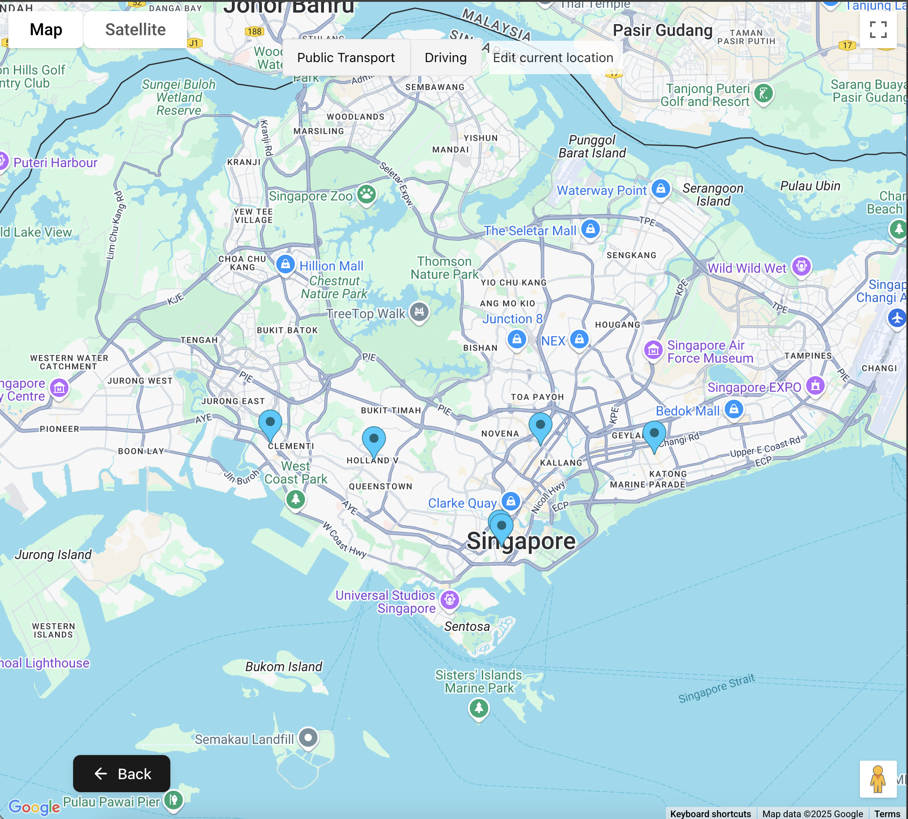

# Mapping out website links with Aumi

Aumi takes an url and renders on a map, the list of locations found on the page. Useful for planning out vacations, new places to explore etc.
1. Input the website/tiktok/rednote link

2. Map renders the locations found on the page

3. Address and direction info are rendered by clicking on the location

## Todo

- ~~Add traffic navigation - get users current location~~
- ~~Adopt proper compoenents from chakra~~
- ~~Allow edits to user location~~
- ~~Add video and image parsing~~ Note! will not work on videos with no captions/descriptions, and the accuracy for photo ocr is limited atm
- ~~Integrate with telegram as web app bot~~
- Omg the phone ui looks so bad - migrate to shardcn(?)
- Add proper non-local cache for scrapper calls
- Add rate limiter and quota
- Deploy
- Register user info + save chat data
- Add tests
- Set up dark and light mode

## Challenges:
1. **Effective queries** - Reduce token size by refining parsed html (could experiment with prompts or using local models).
2. **Address accuracy/relevance** - How do we guarantee the address returned are correct and relevant, especially for places with multiple branches? Can we handle videos without frame by frame parsing?
3. **Cost efficiency** - things to consider: cache url -> placeInfo, swap to MapBox or try to integrate it w GMaps in the future
4. **Performance + security** (not a problem for now) - telegram chat and input validation, *rate limiting*, queuing requests (scrapper processing time is already quite long)

## Future features:
- Past URL views can be managed (merge multiple lists, edit and delete locations etc)
- Expand to beyond cafes
- Allow for edits (possibly shared across group chat with delta sync though its not very useful at this point)
